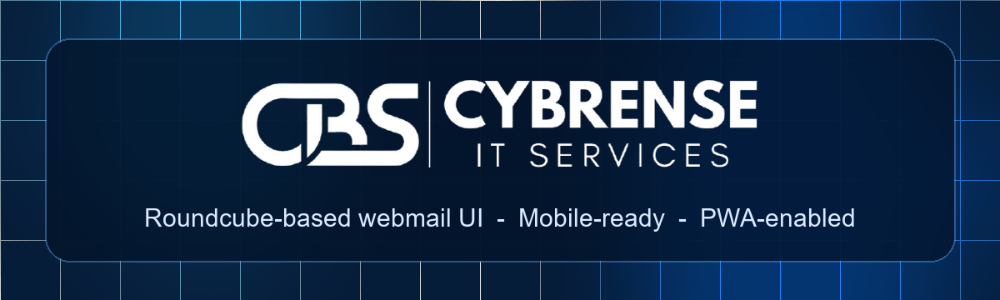
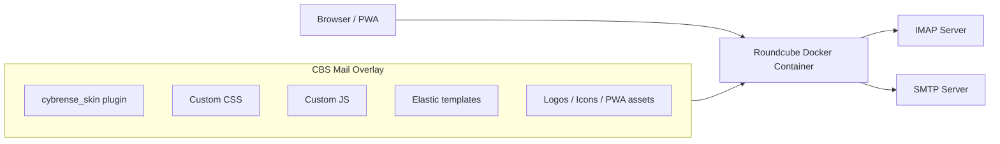

<p align="center">
  <a href="https://github.com/MrBoodj011/CBS_Mail">
    
  </a>
</p>

<h1 align="center">CBS Mail</h1>

<p align="center">
  A modern, mobile-ready Roundcube webmail experience with a custom Cybrense/CBS
  UI skin, plugin layer, PWA support, and synchronized per-user label management.
</p>

<p align="center">
  <a href="https://github.com/MrBoodj011/CBS_Mail/blob/main/LICENSE"></a>
  <a href="https://github.com/MrBoodj011/CBS_Mail/actions/workflows/ci.yml"></a>
  <a href="https://roundcube.net/"></a>
  <a href="https://cybrense.com/"></a>
  
  
  
</p>

<p align="center">
  <a href="#why-cbs-mail">Why</a>
  |
  <a href="#project-website">Website</a>
  |
  <a href="#features">Features</a>
  |
  <a href="#quick-start">Quick Start</a>
  |
  <a href="#architecture">Architecture</a>
  |
  <a href="#brand">Brand</a>
  |
  <a href="#project-docs">Docs</a>
  |
  <a href="#open-source-and-credits">Credits</a>
</p>

---

## Project Website

The repository includes the responsive public CBS Mail landing site in
[`site/`](site/). It uses real desktop and mobile product captures and documents
the Roundcube foundation, features, Docker setup, architecture, and contribution
workflow.

Run it locally:

```bash
npm ci
npm run site:serve
```

Then open <http://127.0.0.1:4173/>. The dedicated Playwright suite validates the
site at desktop, tablet, and mobile widths:

```bash
npm run site:test
```

The production Nginx example is available at
[`deploy/nginx-cbsmail-site.conf.example`](deploy/nginx-cbsmail-site.conf.example).

## Why CBS Mail

Roundcube is powerful and reliable, but its default interface can feel dated for
teams that want a branded, app-like webmail experience. CBS Mail keeps
Roundcube as the mail engine and adds a polished interface layer on top:

- a clean Cybrense/CBS visual identity,
- a responsive desktop and mobile shell,
- a PWA-friendly app experience,
- a custom labels workflow,
- and a branded remote-content trust flow.

CBS Mail is intentionally transparent: this is a Roundcube-based reskin and
enhancement layer, not a mail server and not a from-scratch email client.

## UI Coverage

The repository includes the full UI overlay used by the app:

| Area | What CBS Mail changes |
| --- | --- |
| Login | Centered branded login with responsive sizing |
| Mail | Three-panel webmail layout, polished cards, dates, labels, flags |
| Message view | Branded sender card, label controls, body card, remote-content warning |
| Compose | Clean form layout, attachment/options panel, branded send action |
| Contacts & Settings | Shared sidebar/app-shell styling |
| Mobile | Drawer navigation, tappable mail cards, PWA-friendly viewport behavior |

## Features

### Interface

- Branded Roundcube Elastic UI overlay.
- Dark Cybrense/CBS sidebar and app shell.
- Professional toolbar and notification styling.
- Consistent Mail, Contacts, Settings, Login, Compose, and message views.
- Clean mobile layout for phone-sized screens.

### Labels / Etiquettes

- Labels stored in Roundcube user preferences and synchronized across browsers.
- One-click assign/remove behavior.
- Multiple labels on one email.
- Sidebar label filtering and counts.
- Label badges in message list and message view.

Default labels:

```text
Cybrense Team
Securite
Projets
Facturation
Archive
```

The browser keeps an account-scoped cache for fast rendering and automatically
migrates existing v1 data to the signed-in Roundcube user preference:

```text
cybrense.labels.v1.<account-email>
```

### PWA

- Static web app manifest.
- App icons and Apple touch icon.
- Lightweight service worker.
- Installable desktop and mobile web app.
- Safe offline fallback without caching authenticated mail or message bodies.

### Notifications And Server Features

- Official Roundcube browser notifications, configurable per account under
  `Settings > Preferences > Mailbox`.
- One-minute new-mail refresh by default.
- Optional ManageSieve integration for server-side filters and vacation
  responses when the configured mail platform supports it.
- Container health checks and a protected backup workflow.

### Privacy And Remote Content

Roundcube blocks remote resources for privacy. CBS Mail keeps that model and
adds a branded trust flow for known senders and trusted domains.

Trusted domains are an explicit deployment choice, not proof that an email
sender was authenticated. Keep the list narrow because a spoofed sender can
otherwise cause remote images to load and expose tracking information.

Trusted sender data is account-specific. Default trusted senders/domains can be
configured in `config/config.inc.php`.

## What This Project Is Not

- Not a mail server.
- Not a replacement for IMAP or SMTP.
- Not a fork of Roundcube core.
- Not server-side IMAP keywords. Labels are CBS Mail metadata stored in
  Roundcube user preferences, so other mail clients do not see them.

## Quick Start

Requirements:

- Docker Desktop or Docker Engine
- Docker Compose

Clone:

```bash
git clone https://github.com/MrBoodj011/CBS_Mail.git
cd CBS_Mail
```

Create local config:

```bash
cp .env.example .env
cp config/config.inc.example.php config/config.inc.php
```

Windows PowerShell:

```powershell
Copy-Item .env.example .env
Copy-Item config\config.inc.example.php config\config.inc.php
```

Edit `.env` and `config/config.inc.php` for your IMAP/SMTP server.

Set a unique 24-character Roundcube DES key:

```php
$config['des_key'] = 'CHANGE_ME_24_CHAR_SECRET';
```

Build and start:

```bash
docker compose up -d --build
```

Open:

```text
http://127.0.0.1:8090/
```

## Configuration

The real local config is ignored by Git:

```text
.env
config/config.inc.php
config/config.docker.inc.php
db/
scratch/
```

Safe templates included in the repository:

```text
.env.example
config/config.inc.example.php
```

Default Docker values:

```env
ROUNDCUBEMAIL_DEFAULT_HOST=ssl://imap.example.com
ROUNDCUBEMAIL_DEFAULT_PORT=993
ROUNDCUBEMAIL_SMTP_SERVER=ssl://smtp.example.com
ROUNDCUBEMAIL_SMTP_PORT=465
ROUNDCUBEMAIL_TRUSTED_HOST=mail.example.com
```

SQLite data is persisted through the `./db:/var/roundcube/db` mount used by the
official Roundcube image.

The CBS Mail overlay is baked into a local `cbs-mail:local` image. Only runtime
state and private configuration are mounted, which prevents partial UI updates
and avoids upstream entrypoint warnings from file-level UI mounts.

The currently pinned upstream image contains Roundcube 1.7.1. Dependabot checks
the Docker base weekly; digest updates still pass the full desktop/mobile suite
before they can be merged.

## Architecture

CBS Mail builds a small overlay image on top of a digest-pinned official
Roundcube image.



Main paths:

```text
.
|-- branding/                 # Logos, favicons, PWA icons, watermark
|-- config/                   # Public config examples
|-- plugins/cybrense_skin/    # Plugin, CSS, JS, PWA loader
|-- pwa/                      # Manifest and service worker
|-- templates/                # Customized Roundcube Elastic templates
|-- Dockerfile                # Reproducible Roundcube overlay image
|-- docker-compose.yml        # Local/production container definition
|-- .env.example              # Safe local environment template
|-- CONTRIBUTING.md
|-- SECURITY.md
|-- NOTICE
`-- LICENSE
```

Runtime mounts:

```yaml
- ./db:/var/roundcube/db
- ./config/config.inc.php:/var/www/html/config/config.inc.php
```

## Custom Plugin

Main plugin:

```text
plugins/cybrense_skin/cybrense_skin.php
```

The plugin:

- loads custom CSS and JavaScript,
- injects PWA metadata,
- registers branded favicon/app icons,
- syncs trusted remote senders to the frontend,
- syncs trusted remote domains so configured company senders do not get a repeated warning,
- hooks into Roundcube `message_check_safe`,
- registers `plugin.cybrense_trust_sender`,
- registers the authenticated `plugin.cybrense_labels_save` action,
- validates and stores labels in Roundcube user preferences.

Loaded styles:

```text
cybrense_tokens.css
cybrense_ui.css
cybrense_mobile.css
cybrense_compact.css
cybrense_labels.css
cybrense_login.css
cybrense_about.css
```

Loaded scripts:

```text
cybrense_ui.js
cybrense_pwa.js
```

Roundcube serves plugin assets through `static.php`:

```text
/static.php/plugins/cybrense_skin/cybrense_ui.js
```

## Brand

CBS Mail uses the Cybrense/CBS visual identity across the webmail shell:

- Header and README artwork: `docs/assets/readme-header.png`
- Product logos, favicons, and PWA icons: `branding/`

Official Cybrense website:

```text
https://cybrense.com/
```

## Project Docs

- `CONTRIBUTING.md` - local setup, verification, and pull request guidance.
- `SECURITY.md` - private security reporting and sensitive-data rules.
- `SUPPORT.md` - support expectations and bug report guidance.
- `CODE_OF_CONDUCT.md` - community behavior expectations.
- `docs/CONFIGURATION.md` - config keys, env vars, labels, PWA, and remote-content settings.
- `docs/TROUBLESHOOTING.md` - common setup, cache, PWA, labels, and mobile issues.
- `docs/DEPLOYMENT.md` - generic production deployment checklist.
- `docs/BRANDING.md` - branding assets and forking guidance.
- `docs/MAINTENANCE.md` - CI, release, and repo hygiene workflow.
- `docs/MAIL_SERVER_ADMIN.md` - mailbox administration and ManageSieve boundaries.
- `docs/ROADMAP.md` - short-term and long-term project direction.

## Development Checks

Install development dependencies:

```bash
npm ci
```

JavaScript:

```bash
node --check plugins/cybrense_skin/cybrense_ui.js
node --check plugins/cybrense_skin/cybrense_pwa.js
```

Docker Compose:

```bash
docker compose config --quiet
docker compose -f tests/docker-compose.e2e.yml config --quiet
```

PHP, after the container is running:

```bash
docker exec roundcube php -l /var/www/html/plugins/cybrense_skin/cybrense_skin.php
docker exec roundcube php -l /var/www/html/plugins/cybrense_skin/cybrense_label_store.php
```

Security, CSS quality, and real desktop/mobile browser tests:

```bash
npm run check:security
npm run check:css
docker compose -f tests/docker-compose.e2e.yml up -d
npm run test:e2e
docker compose -f tests/docker-compose.e2e.yml down -v
```

CSS brace sanity check:

```bash
node - <<'NODE'
const fs = require('fs');
const files = [
  'plugins/cybrense_skin/cybrense_ui.css',
  'plugins/cybrense_skin/cybrense_mobile.css',
  'plugins/cybrense_skin/cybrense_compact.css',
  'plugins/cybrense_skin/cybrense_labels.css',
  'plugins/cybrense_skin/cybrense_login.css'
];
for (const file of files) {
  const css = fs.readFileSync(file, 'utf8');
  let depth = 0;
  let min = 0;
  for (const ch of css) {
    if (ch === '{') depth++;
    else if (ch === '}') depth--;
    if (depth < min) min = depth;
  }
  console.log(`${file}: depth=${depth}, min=${min}`);
  if (depth !== 0 || min < 0) process.exitCode = 1;
}
NODE
```

## Cache Notes

If the browser keeps showing old UI after CSS/JS changes:

1. Hard refresh the page.
2. For installed PWA mode, close and reopen the app.
3. If needed, unregister the service worker in browser devtools.

The service worker is deliberately network-first. It caches only static PWA
fallback assets and never stores authenticated mail content.

## Open Source And Credits

CBS Mail is built on top of [Roundcube Webmail](https://roundcube.net/).
Roundcube remains under its own upstream license. See:

- <https://roundcube.net/>
- <https://roundcube.net/license/>

Unless a file states otherwise, custom source code and documentation in this
repository are released under GPL-3.0-or-later. See `LICENSE`.

Branding note:

- The Cybrense/CBS names, logos, and visual assets are included so the interface
  works as designed.
- They are not a grant of trademark rights.
- Forks for other organizations should replace the branding, product name, PWA
  metadata, and default trusted sender/domain settings.

See `NOTICE` for details.

## Contributing

Contributions are welcome. See `CONTRIBUTING.md`.

## Security

Please do not open public issues for exploitable security problems. See
`SECURITY.md`.
